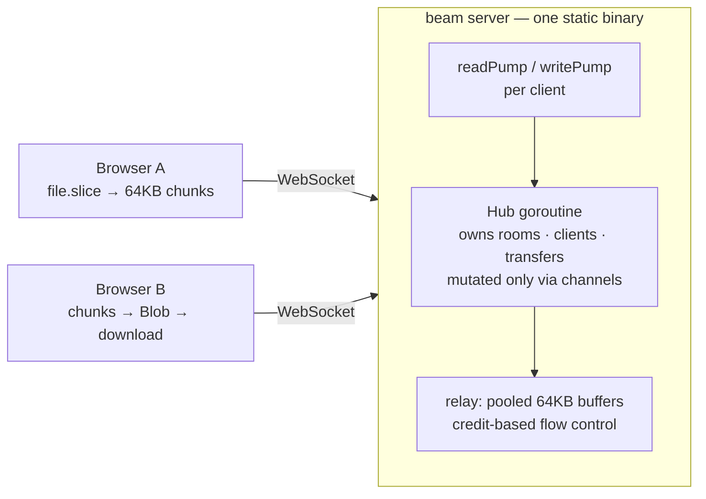

# beam

[](https://github.com/TamerlanK/beam/actions/workflows/ci.yml)

**Drop files between any two devices through the browser.** No installs, no accounts, no cloud storage — devices on the same network see each other automatically as friendly avatars ("Purple Falcon 🦅"), devices on different networks connect with a 4-character code or QR scan, and files stream straight through a relay that never touches disk. One static Go binary serves everything.

<p align="center"><em>go run ./cmd/beam → open http://localhost:8080 on two devices → drag a file onto a peer</em></p>

## Features

- **Zero setup** — open the page on two devices; same-network devices are grouped automatically (by public IP) and appear as avatar cards
- **Cross-network rooms** — a 4-char code (unambiguous alphabet, 10-minute idle TTL) or QR scan joins a device from anywhere into your room
- **Streamed transfers** — accept/decline prompt, then 64KB chunks relayed with live progress (%, MB/s, ETA) on both sides; multi-file queues per peer, concurrent transfers across pairs
- **Text snippets** — send a link or note; the receiver gets a copy-to-clipboard card
- **Ephemeral by design** — no database, no server-side storage, nothing written to disk, identities last one session
- **One binary** — the vanilla HTML/CSS/JS frontend is embedded with `embed.FS`; `./beam` is the whole deployment

## Quickstart

```sh
go run ./cmd/beam            # serves on :8080
./beam -addr :9000           # custom port
./beam -debug                # + pprof on /debug/pprof/
./beam -trust-proxy          # honor X-Forwarded-For (only behind a trusted proxy)
```

Docker (~15MB image from `scratch`):

```sh
docker build -t beam .
docker run -p 8080:8080 beam
```

Production runs behind Caddy/nginx for HTTPS/WSS — beam deliberately does no in-process TLS termination.

## Architecture



- JSON control messages and binary data frames share one WebSocket per client (`{"v":1,"type":...}` envelopes; frames are `[16-byte transfer UUID][chunk]`)
- A single hub goroutine owns all state — no locks, no data races by construction
- Full message catalog in [docs/protocol.md](docs/protocol.md); goroutine and lifecycle detail in [docs/architecture.md](docs/architecture.md)

## Engineering highlights

- **Flat memory under any load.** Chunks are relayed through a `sync.Pool` of fixed 64KB buffers; a file is never buffered anywhere. Relaying 50GB uses the same memory as relaying 5MB.
- **Credit-based flow control.** A sender may have at most 16 unacked chunks in flight; the server grants a credit only after the receiver's socket write *completes*, so a slow receiver throttles its sender end-to-end instead of growing server queues. Details in [docs/streaming.md](docs/streaming.md).
- **Backpressure fails clean.** Bounded send queues (64), 10s write deadlines, and non-blocking hub sends mean a stuck receiver fails its own transfer — it cannot consume server memory or stall anyone else.
- **Zero goroutine leaks, proven.** Every client costs exactly two goroutines that provably terminate; a `goleak` test churns 50 connect/transfer/disconnect cycles and verifies none survive.
- **Hostile-input hardening.** Every message is schema-validated with strict caps (filename ≤255B sanitized, size ≤50GB, snippet ≤8KB, 1MB read limit); the transfer state machine rejects illegal transitions (wrong-client answers, double accepts, cancel-after-complete) with protocol errors, never panics; room-code joins are token-bucket rate-limited per IP; the envelope parser is fuzz-tested.
- **Observable.** Structured `slog` JSON logs for every transfer lifecycle event; optional pprof; a load harness (`make loadtest`) reporting throughput, p50/p99 relay latency, and peak RSS.

## Design decisions & tradeoffs

Recorded as dated ADRs in [docs/decisions.md](docs/decisions.md). The big ones:

- **Relay over WebRTC** — a server relay works through every NAT/firewall with zero signaling complexity; the cost is server bandwidth. WebRTC P2P (with the relay as fallback) is the natural next step.
- **Receiver assembles a Blob in memory** — the price of a no-install browser receiver; fine for the multi-GB range, not for files larger than RAM. See [docs/streaming.md](docs/streaming.md).
- **Rooms keyed by public IP** — same-NAT devices find each other with zero configuration; devices behind carrier-grade NAT may see strangers, which is why every transfer needs an explicit accept.
- **Sender-generated transfer UUIDs** — lets the sender start streaming immediately on acceptance without an ID round trip; the server validates format and uniqueness.

## Development

```sh
make test        # unit + integration (incl. 50MB SHA-256-verified stream)
make race        # same, with the race detector
make lint        # go vet + golangci-lint
make loadtest    # 200 clients, 50 rooms, 25 concurrent 20MB transfers
```

## Future work

- WebRTC data channels for true P2P (relay as fallback)
- End-to-end encryption (relay already never inspects payloads)
- Resumable transfers (chunk index is already explicit in the protocol)
- PWA share-target so "Share → beam" works from mobile OS share sheets
