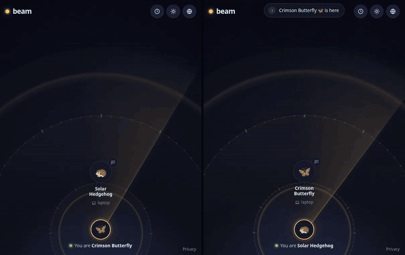
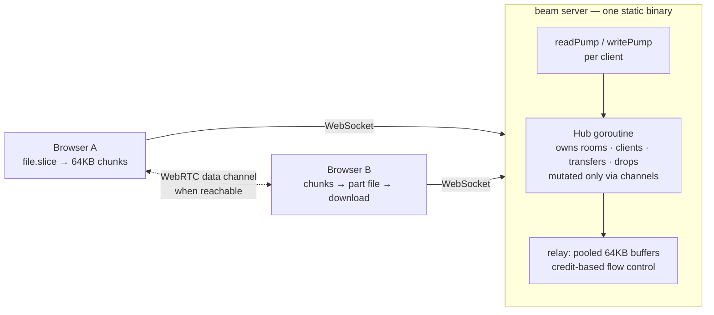

# beam

[](https://github.com/TamerlanK/beam/actions/workflows/ci.yml)
[](https://github.com/TamerlanK/beam/releases)
[](LICENSE)

**Drop files between any two devices through the browser.** No installs, no accounts, no cloud storage — devices on the same network see each other automatically as friendly avatars ("Purple Falcon 🦅"), devices on different networks connect with a 4-character code or QR scan, and files stream straight through a relay that never touches disk. One static Go binary serves everything.

<p align="center">
  
</p>
<p align="center"><em>Left: sender. Right: receiver. Pick files for a device → preview and accept → encrypted transfer with matching verification codes → send a note → show the code + QR for a device on another network.</em></p>

```sh
go run ./cmd/beam        # then open http://localhost:8080 on two devices
```

## Features

- **Zero setup** — open the page on two devices; same-network devices are grouped automatically (by public IP) and appear as avatar cards on a radar
- **Cross-network rooms** — a 4-char code (unambiguous alphabet, 10-minute idle TTL) or QR scan joins a device from anywhere into your room
- **Streamed transfers** — accept/decline prompt, then 64KB chunks relayed with live progress (%, MB/s, ETA) on both sides; multi-file queues per peer, concurrent transfers across pairs
- **Direct when possible** — same-network and STUN-reachable devices negotiate a WebRTC data channel and stream peer-to-peer at LAN speed; anything else falls back to the relay automatically
- **End-to-end encrypted** — every transfer negotiates an ephemeral ECDH key and seals chunks with AES-256-GCM in the browser; both sides show a matching 4-character verification code, and the relay only ever sees ciphertext
- **Streams to disk, everywhere** — the receiver writes chunks into a part file in the browser's origin-private file system (Chrome, Firefox, Safari), so multi-GB transfers never touch RAM; on Chromium the finished file is then moved into the location you picked, elsewhere it becomes a download
- **Survives a reload** — close the tab, crash the browser, put the laptop to sleep: both sides keep what they need (the receiver its part file and key, the sender its file handle and offset) in IndexedDB and pick up where they left off the next time the two devices see each other, for up to a day
- **Installable** — a PWA with a share target: "Share → beam" from any app on Android or desktop, then tap the device
- **One device, one presence** — extra tabs in the same browser wait behind a gate instead of showing up as duplicate devices; "Use this tab instead" hands the connection over, unless the other tab is mid-transfer
- **Previews, staging, live graphs** — images and PDFs show a thumbnail in the accept prompt before a byte is transferred; drop files anywhere to stage them and pick the device after; every transfer row plots its throughput
- **Text snippets** — send a link or note; the receiver gets a copy-to-clipboard card
- **Drops: leave it for later** — when the other device doesn't answer, "Leave for later" hands the sealed file to the server, which holds it in memory (never on disk) for 10 minutes and delivers it whenever that device shows up, even after you close your tab. "Get a link" does the same for anyone: the key rides in the URL fragment, so the server can't read it either. Capped per drop, per address and globally; off with `-drop-max 0`
- **History** — the last 50 transfers stay in the panel with a "Save again" button for a couple of minutes after a receive; your name and avatar are editable and persist per browser
- **Light and dark, keyboard and screen-reader friendly** — theme follows the system and can be toggled; dialogs are native `<dialog>`s with focus management and live regions
- **Ephemeral by design** — no database, no server-side storage, nothing written to disk; a drop is the one thing the server holds, as ciphertext, in RAM, for minutes
- **One binary** — the vanilla HTML/CSS/JS frontend is embedded with `embed.FS`; `./beam` is the whole deployment

## Using beam

**Same network.** Open beam on both devices. Each one gets a random name and animal avatar and shows up on the other's radar within a second. Click a device (or drag files onto it) to send; the receiver gets a prompt with the file list, a thumbnail for images and PDFs, and an Accept/Decline choice. Both sides then show a progress ring on the avatar, and the Transfers panel shows throughput, ETA, a live graph and the 4-character verification code, which should match on both screens.

**Another network.** Click **Connect a device** on one side. It shows a 4-character code and a QR that encodes the join link. On the other device, type the code or scan the QR; that device joins your room and appears on your radar as if it were local. Codes expire after 10 minutes idle and joins are rate-limited per IP.

**Notes.** The small speech-bubble button on a device card sends a text snippet (up to 8KB): a link, an address, a one-time code. It appears on the other screen immediately with a Copy button.

**Leave it for later.** If the other device is offline or doesn't answer, choose **Leave for later** in the transfer row. The file is encrypted to that device's key and parked on the server, in memory, for 10 minutes; it is delivered as soon as the device shows up, even if you have closed your tab. **Get a link** does the same for anyone: the decryption key lives in the link's `#fragment`, which never reaches the server.

**Resume.** Lose Wi-Fi, close the tab, or put the laptop to sleep mid-transfer. When the two devices next see each other, the sender re-offers from where it stopped and the receiver answers with how much it actually holds, so only the remainder is sent. On a fresh page load the browser may ask for one click to re-grant access to the file.

**Share from other apps.** Install beam as a PWA (browser menu → Install). On Android and desktop Chromium it registers as a share target, so "Share → beam" from any app opens beam with the files staged; tap the device to send.

**Staging.** Drop files anywhere on the page, not just on a device, to stage them. A bar appears at the top; tap a device to send them there, or **Get a link** to leave them on the server.

## Quickstart

```sh
go run ./cmd/beam            # serves on :8080
./beam -addr :9000           # custom port
./beam -debug                # + pprof on /debug/pprof/
./beam -trust-proxy          # honor X-Forwarded-For (only behind a trusted proxy)
./beam -log-format json      # machine-readable logs
```

| Flag | Default | What it does |
| --- | --- | --- |
| `-addr` | `:8080` | Listen address |
| `-trust-proxy` | off | Use `X-Forwarded-For` for room grouping. Only enable behind a proxy you control |
| `-max-conns-per-ip` | `32` | Concurrent WebSocket connections per IP (`0` = unlimited) |
| `-relay-bps` | `0` | Global relay budget in bytes/s (`0` = unlimited) |
| `-drop-max` | `200MB` | Max bytes per drop held for later pickup (`0` disables drops) |
| `-drop-budget` | `1GB` | Total bytes of drops held in memory at once (`0` = unlimited) |
| `-drop-ttl` | `10m` | How long a drop waits to be picked up |
| `-contact` | | Operator email or URL shown on `/privacy` |
| `-log-format` | `text` | `text` or `json` |
| `-debug` | off | Serve pprof on `/debug/pprof/` |

`/healthz` returns 200 for load balancers.

Prebuilt binaries for Linux, macOS and Windows are on the [releases page](https://github.com/TamerlanK/beam/releases); every tag also publishes a multi-arch image (~15MB, from `scratch`):

```sh
docker run -p 8080:8080 ghcr.io/tamerlank/beam
docker build -t beam . && docker run -p 8080:8080 beam   # or build it yourself
```

### Behind a reverse proxy

beam deliberately does no in-process TLS termination. Run it behind Caddy or nginx for HTTPS/WSS, which the browser also needs for Web Crypto, the File System Access API and PWA install on anything other than `localhost`:

```sh
./beam -addr 127.0.0.1:8080 -trust-proxy
```

```caddyfile
beam.example.com {
    reverse_proxy 127.0.0.1:8080
}
```

`-trust-proxy` is what lets same-network devices find each other when every connection arrives from the proxy's address.

## Browser support

| | Chrome / Edge | Firefox | Safari |
| --- | --- | --- | --- |
| Send and receive, E2E encryption, resume | ✓ | ✓ | ✓ |
| Stream to disk while receiving (OPFS part file) | ✓ | ✓ | ✓ |
| Save straight into a chosen file/folder | ✓ | download | download |
| Resume a *send* after a reload (needs a file handle) | ✓ | | |
| WebRTC direct path | ✓ | ✓ | ✓ |
| Install as PWA / share target | ✓ | Android only | home screen, no share target |

## Architecture



- JSON control messages and binary data frames share one WebSocket per client (`{"v":1,"type":...}` envelopes; frames are `[16-byte transfer UUID][chunk]`)
- A single hub goroutine owns all state — no locks, no data races by construction
- The WebRTC data channel carries the same envelopes; the browsers negotiate it among themselves and fall back to the relay per transfer
- Full message catalog in [docs/protocol.md](docs/protocol.md); goroutine and lifecycle detail in [docs/architecture.md](docs/architecture.md); streaming and memory model in [docs/streaming.md](docs/streaming.md)

## Engineering highlights

- **Flat memory under any load.** Chunks are relayed through a `sync.Pool` of fixed 64KB buffers; a file is never buffered anywhere. Relaying 50GB uses the same memory as relaying 5MB.
- **Resume after anything.** The sender re-offers with the same transfer ID and an offset hint; the receiver answers with the offset it actually holds, so the relay only carries the remainder and the server keeps no state. A dropped link resumes from memory within two minutes. A closed tab resumes from IndexedDB: the receiver's part file lives in the origin-private file system and is written through a sync access handle, so every chunk is on disk before it is counted; the sender keeps its file-system handle and asks for one click if the browser wants permission again.
- **Credit-based flow control.** A sender may have at most 16 unacked chunks in flight; the server grants a credit only after the receiver's socket write *completes*, so a slow receiver throttles its sender end-to-end instead of growing server queues. Details in [docs/streaming.md](docs/streaming.md).
- **Backpressure fails clean.** Bounded send queues (64), 10s write deadlines, and non-blocking hub sends mean a stuck receiver fails its own transfer — it cannot consume server memory or stall anyone else.
- **Zero goroutine leaks, proven.** Every client costs exactly two goroutines that provably terminate; a `goleak` test churns 50 connect/transfer/disconnect cycles and verifies none survive.
- **Hostile-input hardening.** Every message is schema-validated with strict caps (filename ≤255B sanitized, size ≤50GB, snippet ≤8KB, 1MB read limit); the transfer state machine rejects illegal transitions (wrong-client answers, double accepts, cancel-after-complete) with protocol errors, never panics; room-code joins are token-bucket rate-limited per IP; the envelope parser is fuzz-tested.
- **Observable.** Structured `slog` logs for every transfer lifecycle event (readable text by default, `-log-format json` for machines); optional pprof; a load harness (`make loadtest`) reporting throughput, p50/p99 relay latency, and peak RSS.

## Design decisions & tradeoffs

Recorded as dated ADRs in [docs/decisions.md](docs/decisions.md). The big ones:

- **Relay first, WebRTC on top** — the relay works through every NAT/firewall and keeps the protocol exhaustively testable; a data channel is an optimization the browsers negotiate among themselves and the same envelopes flow over either pipe.
- **Per-transfer ephemeral keys** — one ECDH exchange per file, piggybacked on the existing offer/answer; no identity keys, no key storage, forward secrecy for free. The verification code is the honest answer to a malicious relay.
- **Receiver streams to disk where the browser allows it** — OPFS part file everywhere it exists, then File System Access on Chromium or a download elsewhere. See [docs/streaming.md](docs/streaming.md).
- **Rooms keyed by public IP, /64 for IPv6** — same-NAT devices find each other with zero configuration; devices behind carrier-grade NAT or a shared /64 may see strangers, which is why every transfer needs an explicit accept.
- **Sender-generated transfer UUIDs** — lets the sender start streaming immediately on acceptance without an ID round trip; the server validates format and uniqueness.
- **One tab owns the device** — Web Locks leader election keeps a browser to one presence; other tabs wait behind a gate and can take over.
- **Drops hold ciphertext only** — the first and only time the server keeps user bytes: sealed to the addressee's long-lived device key (or to a random key that lives in the link's fragment), bounded by size, count, budget and TTL, and gone after one pickup.
- **No TLS in-process, no build step** — the proxy terminates TLS; the frontend is vanilla JS served from `embed.FS`, so `go build` is the whole pipeline.

## Development

Needs Go 1.27+, [golangci-lint](https://golangci-lint.run/welcome/install/) v2, and Node 22+ (Prettier runs through `npx` and the browser crypto tests run under `node --test`; nothing to install). Live reload needs [gow](https://github.com/mitranim/gow): `go install github.com/mitranim/gow@latest`.

```sh
make dev         # run with live reload on .go/.html/.css/.js changes
make test        # Go unit + integration (incl. 50MB SHA-256-verified stream), Node tests for crypto.js
make race        # same, with the race detector
make fmt         # gofmt + prettier — run before pushing
make lint        # go vet, gofmt, golangci-lint, prettier — exactly what CI runs
make loadtest    # 200 clients, 50 rooms, 25 concurrent 20MB transfers
make build       # static binary ./beam
```

Formatting is enforced in CI, so `make fmt` is the only style rule. Line endings are LF everywhere via `.gitattributes`; Windows clones need no extra setup. Bulk reformat commits are listed in `.git-blame-ignore-revs`, which GitHub skips in blame automatically.

Layout:

```
cmd/beam        entrypoint and flags
cmd/loadtest    load harness
internal/hub    the hub goroutine: rooms, clients, transfers, drops, relay
internal/server HTTP + WebSocket upgrade, embedded assets, integration and leak tests
internal/protocol  envelope parsing and validation (fuzzed)
internal/names  avatar names
web/static      the frontend: vanilla ES modules, no bundler
docs/           protocol, architecture, streaming, ADRs
```

## Future work

- TURN support for symmetric-NAT pairs that currently fall back to the relay
- Streaming receive on Firefox and Safari via a service-worker download stream

## License

MIT — see [LICENSE](LICENSE).
