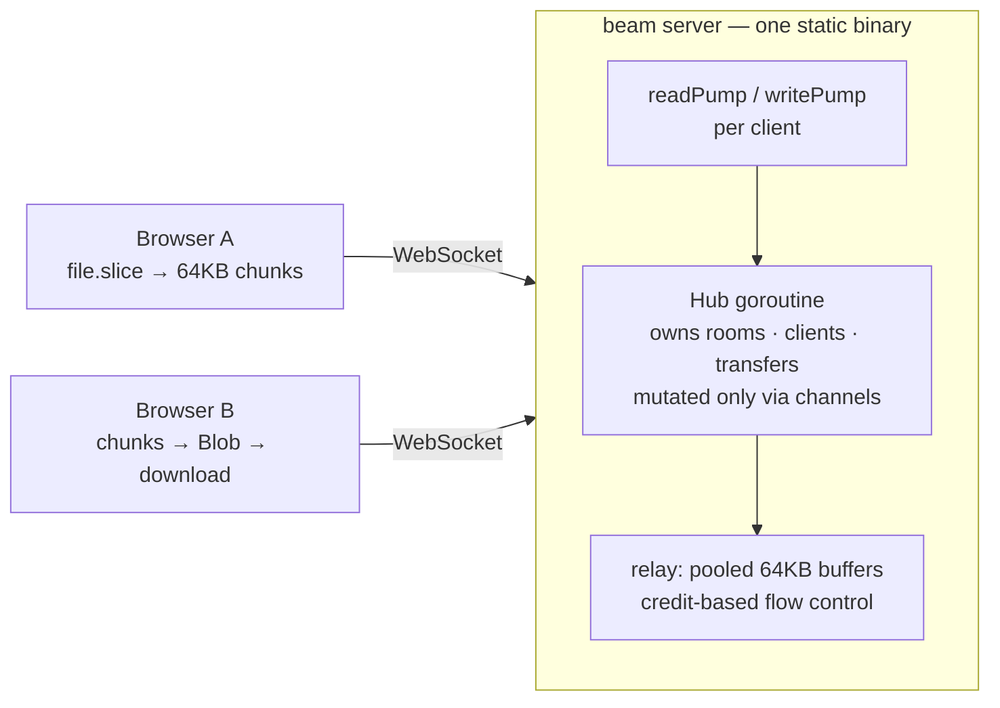

# beam

[](https://github.com/TamerlanK/beam/actions/workflows/ci.yml)

**Drop files between any two devices through the browser.** No installs, no accounts, no cloud storage — devices on the same network see each other automatically as friendly avatars ("Purple Falcon 🦅"), devices on different networks connect with a 4-character code or QR scan, and files stream straight through a relay that never touches disk. One static Go binary serves everything.

<p align="center"><em>go run ./cmd/beam → open http://localhost:8080 on two devices → drag a file onto a peer</em></p>

## Features

- **Zero setup** — open the page on two devices; same-network devices are grouped automatically (by public IP) and appear as avatar cards
- **Cross-network rooms** — a 4-char code (unambiguous alphabet, 10-minute idle TTL) or QR scan joins a device from anywhere into your room
- **Streamed transfers** — accept/decline prompt, then 64KB chunks relayed with live progress (%, MB/s, ETA) on both sides; multi-file queues per peer, concurrent transfers across pairs
- **Direct when possible** — same-network and STUN-reachable devices negotiate a WebRTC data channel and stream peer-to-peer at LAN speed; anything else falls back to the relay automatically
- **End-to-end encrypted** — every transfer negotiates an ephemeral ECDH key and seals chunks with AES-256-GCM in the browser; both sides show a matching 4-character verification code, and the relay only ever sees ciphertext
- **Streams to disk, everywhere** — the receiver writes chunks into a part file in the browser's origin-private file system (Chrome, Firefox, Safari), so multi-GB transfers never touch RAM; on Chromium the finished file is then moved into the location you picked, elsewhere it becomes a download
- **Survives a reload** — close the tab, crash the browser, put the laptop to sleep: both sides keep what they need (the receiver its part file and key, the sender its file handle and offset) in IndexedDB and pick up where they left off the next time the two devices see each other, for up to a day
- **Installable** — a PWA with a share target: "Share → beam" from any app on Android or desktop, then tap the device
- **One device, one presence** — extra tabs in the same browser wait behind a gate instead of showing up as duplicate devices; "Use this tab instead" hands the connection over, unless the other tab is mid-transfer
- **Previews, staging, live graphs** — images and PDFs show a thumbnail in the accept prompt before a byte is transferred; drop files anywhere to stage them and pick the device after; every transfer row plots its throughput
- **Text snippets** — send a link or note; the receiver gets a copy-to-clipboard card
- **Drops: leave it for later** — when the other device doesn't answer, "Leave for later" hands the sealed file to the server, which holds it in memory (never on disk) for 10 minutes and delivers it whenever that device shows up, even after you close your tab. "Get a link" does the same for anyone: the key rides in the URL fragment, so the server can't read it either. Capped per drop, per address and globally; off with `-drop-max 0`
- **Ephemeral by design** — no database, no server-side storage, nothing written to disk; a drop is the one thing the server holds, as ciphertext, in RAM, for minutes
- **One binary** — the vanilla HTML/CSS/JS frontend is embedded with `embed.FS`; `./beam` is the whole deployment

## Quickstart

```sh
go run ./cmd/beam            # serves on :8080
./beam -addr :9000           # custom port
./beam -debug                # + pprof on /debug/pprof/
./beam -trust-proxy          # honor X-Forwarded-For (only behind a trusted proxy)
./beam -max-conns-per-ip 8   # cap concurrent sockets per IP (default 32, 0 = unlimited)
./beam -relay-bps 10000000   # global relay budget in bytes/s (default 0 = unlimited)
./beam -drop-max 0           # disable drops; default holds up to 200MB per drop
./beam -drop-budget 1073741824 -drop-ttl 10m   # total held ciphertext and pickup window
```

Docker (~15MB image from `scratch`):

```sh
docker build -t beam .
docker run -p 8080:8080 beam
```

Production runs behind Caddy/nginx for HTTPS/WSS — beam deliberately does no in-process TLS termination.

## Architecture



- JSON control messages and binary data frames share one WebSocket per client (`{"v":1,"type":...}` envelopes; frames are `[16-byte transfer UUID][chunk]`)
- A single hub goroutine owns all state — no locks, no data races by construction
- Full message catalog in [docs/protocol.md](docs/protocol.md); goroutine and lifecycle detail in [docs/architecture.md](docs/architecture.md)

## Engineering highlights

- **Flat memory under any load.** Chunks are relayed through a `sync.Pool` of fixed 64KB buffers; a file is never buffered anywhere. Relaying 50GB uses the same memory as relaying 5MB.
- **Resume after anything.** The sender re-offers with the same transfer ID and an offset hint; the receiver answers with the offset it actually holds, so the relay only carries the remainder and the server keeps no state. A dropped link resumes from memory within two minutes. A closed tab resumes from IndexedDB: the receiver's part file lives in the origin-private file system and is written through a sync access handle, so every chunk is on disk before it is counted; the sender keeps its file-system handle and asks for one click if the browser wants permission again.
- **Credit-based flow control.** A sender may have at most 16 unacked chunks in flight; the server grants a credit only after the receiver's socket write *completes*, so a slow receiver throttles its sender end-to-end instead of growing server queues. Details in [docs/streaming.md](docs/streaming.md).
- **Backpressure fails clean.** Bounded send queues (64), 10s write deadlines, and non-blocking hub sends mean a stuck receiver fails its own transfer — it cannot consume server memory or stall anyone else.
- **Zero goroutine leaks, proven.** Every client costs exactly two goroutines that provably terminate; a `goleak` test churns 50 connect/transfer/disconnect cycles and verifies none survive.
- **Hostile-input hardening.** Every message is schema-validated with strict caps (filename ≤255B sanitized, size ≤50GB, snippet ≤8KB, 1MB read limit); the transfer state machine rejects illegal transitions (wrong-client answers, double accepts, cancel-after-complete) with protocol errors, never panics; room-code joins are token-bucket rate-limited per IP; the envelope parser is fuzz-tested.
- **Observable.** Structured `slog` logs for every transfer lifecycle event (readable text by default, `-log-format json` for machines); optional pprof; a load harness (`make loadtest`) reporting throughput, p50/p99 relay latency, and peak RSS.

## Design decisions & tradeoffs

Recorded as dated ADRs in [docs/decisions.md](docs/decisions.md). The big ones:

- **Relay first, WebRTC on top** — the relay works through every NAT/firewall and keeps the protocol exhaustively testable; a data channel is an optimization the browsers negotiate among themselves and the same envelopes flow over either pipe.
- **Per-transfer ephemeral keys** — one ECDH exchange per file, piggybacked on the existing offer/answer; no identity keys, no key storage, forward secrecy for free. The verification code is the honest answer to a malicious relay.
- **Receiver streams to disk where the browser allows it** — File System Access on Chromium, in-memory Blob elsewhere. See [docs/streaming.md](docs/streaming.md).
- **Rooms keyed by public IP** — same-NAT devices find each other with zero configuration; devices behind carrier-grade NAT may see strangers, which is why every transfer needs an explicit accept.
- **Sender-generated transfer UUIDs** — lets the sender start streaming immediately on acceptance without an ID round trip; the server validates format and uniqueness.
- **Drops hold ciphertext only** — the first and only time the server keeps user bytes: sealed to the addressee's long-lived device key (or to a random key that lives in the link's fragment), bounded by size, count, budget and TTL, and gone after one pickup.

## Development

```sh
make test        # unit + integration (incl. 50MB SHA-256-verified stream)
make race        # same, with the race detector
make lint        # go vet + golangci-lint
make loadtest    # 200 clients, 50 rooms, 25 concurrent 20MB transfers
```

## Future work

- TURN support for symmetric-NAT pairs that currently fall back to the relay
- Streaming receive on Firefox and Safari via a service-worker download stream
