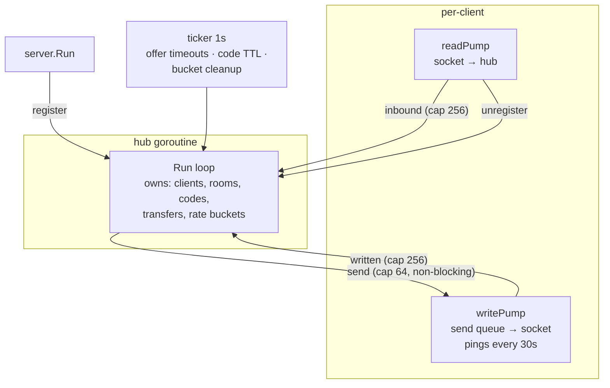

# Architecture

One binary, three moving parts: an HTTP server (static assets + websocket
upgrade), a single **hub** goroutine that owns all shared state, and two
pump goroutines per connected client.

## Goroutines and ownership



**The ownership rule:** every map the hub holds — clients, rooms, codes,
transfers, rate-limit buckets — is touched *only* by the hub goroutine.
Other goroutines communicate exclusively through channels
(`register`/`unregister`/`inbound`/`written`). There are no mutexes and no
lock-ordering to reason about; `go test -race` has nothing to find by
construction.

**The no-deadlock rule** has two halves:

- The hub never blocks: every send toward a client uses a non-blocking
  `select`/`default` (see backpressure policy in
  [streaming.md](streaming.md)).
- Pumps never block forever on the hub: every pump→hub send is a `select`
  paired with the hub's `done` channel, which closes on shutdown.

### Client lifecycle

1. `GET /ws` → upgrade → a `Client` with a fresh UUID, a generated
   adjective-animal name, a device type from the User-Agent, and its
   room-keying IP.
2. `register` → hub adds it to the room for its IP (creating the room as
   needed), broadcasts `peer-joined`, sends the newcomer `room-state`.
3. `readPump` (the HTTP handler goroutine) and `writePump` run until the
   connection dies — from either direction, both pumps converge on closing
   the connection, and `readPump` reports `unregister` exactly once on the
   way out.
4. Hub removes the client: fails its live transfers
   (`peer-disconnected`), broadcasts `peer-left`, deletes empty rooms and
   their codes, closes the send queue (which lets `writePump` flush
   remaining messages and send the websocket close frame).

Heartbeats: server pings every 30s; the read deadline is 60s and is pushed
forward by pongs, so one lost ping is tolerated and a vanished client is
reaped in ≤60s. Writes get 10s.

## Room keying by IP

Rooms are keyed `ip:<addr>` where `<addr>` is the TCP peer address — or
the first `X-Forwarded-For` hop when the server runs with `-trust-proxy`.
Devices behind the same NAT share a public IP, so "same network sees each
other" needs zero configuration. XFF is honored only behind a flag because
otherwise it is attacker-controlled: anyone could spoof their way into any
LAN's room.

A **room code** does not create a room — it *aliases* the creator's
current room, so a cross-network joiner sees the creator's LAN peers too.
Codes: 4 chars from a 32-char unambiguous alphabet (crypto/rand, bias-free
masking), 10-minute idle TTL refreshed by joins, reaped by the hub ticker.
Joins are rate-limited per IP (token bucket: burst 5, one per 2s) so the
~1M code space cannot be brute-forced within a code's lifetime.

## Lifecycle of a transfer, end to end

```
sender A                    hub                         receiver B
   │  transfer-offer         │                              │
   │────────────────────────▶│  validate: peer, name, size, │
   │                         │  UUID; state = Offered;      │
   │                         │  30s timeout armed           │
   │                         │─────transfer-offer(+from)───▶│
   │                         │                              │  accept/decline UI
   │                         │◀────transfer-answer──────────│
   │◀──transfer-answer───────│  state = Accepted            │
   │                         │                              │
   │  chunk #1..16           │  (initial window: 16)        │
   │═══binary frames════════▶│  state = Active on #1        │
   │                         │══════relay (pooled buf)═════▶│
   │                         │◀──written(n) from writePump──│
   │◀──flow-credit {n:1}─────│  credit only after B's       │
   │  …spend, earn, repeat…  │  socket write completed      │
   │                         │                              │
   │  final chunk            │  Written == Size:            │
   │═══════════════════════▶ │  state = Completed           │
   │◀──transfer-complete─────│─────transfer-complete───────▶│  Blob → download
```

Failure paths all converge on `failTransfer`: mark Failed (idempotent —
already-terminal transfers are untouched), notify both live parties with a
reason, delete. Triggers: offer timeout (hub ticker), disconnect of either
party, cancel, protocol violation (wrong sender, overrun size, bad state),
queue overflow on either side, server shutdown.

## Shutdown

`signal.NotifyContext` cancels the root context. `server.Run` then:

1. `http.Server.Shutdown` with a 10s deadline (stops new connections;
   websockets are hijacked and handled next),
2. cancels the hub context: the hub fails every live transfer with reason
   `server-shutdown`, closes every client's send queue (writePump flushes
   the failure notices, then sends a close frame), closes `done` so any
   pump blocked on a hub channel exits,
3. waits for the hub goroutine to return.

The leak test (`TestNoGoroutineLeaks`) proves the sum of all this: after
50 connect/transfer/disconnect cycles and a shutdown, `goleak` finds
nothing running.

## Package map

| package | role |
|---|---|
| `cmd/beam` | flags, slog setup, signal context, exit codes |
| `cmd/loadtest` | load harness: N clients / rooms / concurrent transfers, latency + RSS report |
| `internal/server` | HTTP wiring: embedded static, /healthz, /ws, pprof, graceful shutdown |
| `internal/hub` | the hub goroutine, rooms, client pumps, transfer state machine, relay |
| `internal/protocol` | envelope, message catalog, binary framing, limits — the single wire-format authority |
| `internal/names` | adjective-animal display names |
| `web` | `embed.FS` of the static frontend (`static/js/`: `socket` transport · `state` store + event bus · `transfers` chunk pump/receive · `radar` ring layout, beams, drag-drop · `panel`, `dialogs`, `toast`, `history`, `notify` views · `identity` persisted device · `app` bootstrap) |
